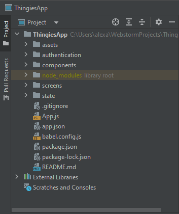

# ThingiesApp

## Install Jetbrains Webstorm
If you have the Webstorm IDE already installed you can skip this step. Otherwise go to www.jetbrains.com and download 
Webstorm. The easiest way to do that is by installing the **JetBrains Toolbox** (https://www.jetbrains.com/toolbox-app/) first. That way you can manage your 
Jetbrains products, licence, and updates in the most comforting way.


## Download Node.js
\
If not done yet, download the Node.js LTS (Long Term Support) version from https://nodejs.org/en/ . Make sure to set the
checkmark for automatic updates (Chocolately included). After installation, restart your computer. After that the node.js 
command line interface (node.js CLI) will be available. Type the following commands in a terminal to check if node.js was installed
successfully:
```cmd
node -v
```
In case you installed the LTS version of node.js this should result in:
```cmd
v18.12.1
```
Do the same for npm (Node Package Manager):
```cmd
npm -v
```
This terminal should now show the following:
```cmd
8.19.2
```
This tutorial was written 22.11.2022. The LTS version might be a different one at a later point.
If the installation was successful you can start cloning the repository.

## Download Expo Go App
If you have an iPhone at home download this the Expo Go app from the App Store:\
https://apps.apple.com/de/app/expo-go/id982107779

For Android download it from the Play Store:\
https://play.google.com/store/apps/details?id=host.exp.exponent&hl=de&gl=US&pli=1

## Clone the ThingiesApp repository (with Webstorm)
When you open Webstorm choose the option "Get from VCS" (Version Control System): \


Use Git as VCS and type in the following URL:\


Trust the project to open it:\


When you open the project, Webstorm shows you a prompt to run 'npm install'. Push that button, this will install all the
necessary packages for the project, which are listed in package.json. If it doesn't show up, run 'npm install' in the terminal: \
\

After you ran 'npm install', the 'node_modules folder will appear in the project folder. This folder includes all the necessary 
binary and libraries to make the app run: \


To start the development server, run 'npx expo start' in the terminal. A QR-Code will show up, which you can scan with your 
Expo App. You will need to allow Expo in your **Firewall**:\
\

If the QR-Code doesn't work, press first '?' and then 'q' to look at the Metro server address. Form example: exp://192.168.178.36:19000. You can type it in your Expo App on your phone. **Don't forget to connect your computer and 
your phone the same network to make Expo work.**\


## Pushing & Merging
The master branch is a protected branch. You can't push your commits directly into this branch. First you have to setup 
a new branch, push your commit to the new branch, and do a pull request on GitHub to merge your commits into the master
branch. Please choose your branch names in a descriptive manner. For example if you are currently working on the map-, todo-,
or calendar screen feature name your branch the respective branch name:
```cmd
feature/todo
```
```cmd
feature/calendar
```
```cmd
feature/map
```

